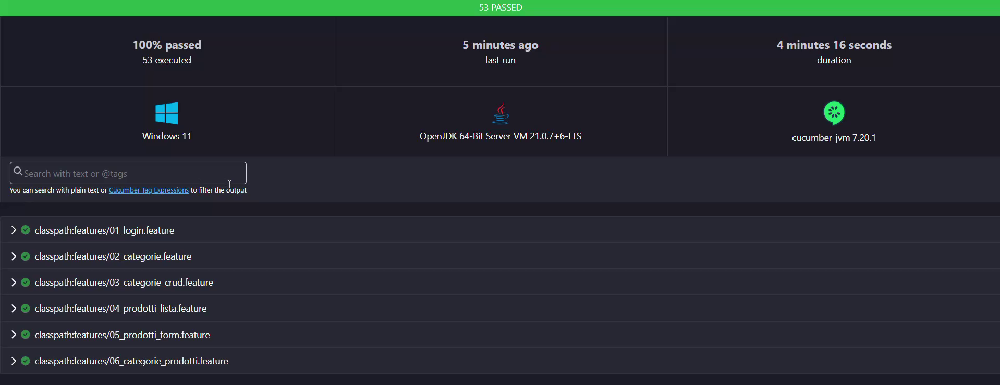

# Selenium + Cucumber – Gestionale per la ristorazione

Suite di test **E2E in BDD** per il gestionale web del Restaurant Management System (frontend **Angular + Angular Material**, backend **.NET**): **53 scenari** scritti in **Gherkin italiano** (`Dato / Quando / Allora`) che pilotano Chrome con **Selenium 4**, con i dati preparati e verificati via API con **REST Assured**.



> Video dell'esecuzione e scheda del progetto nel mio portfolio: <https://portfolio-qa-8f6q.onrender.com>

---

## Cosa copre

| Feature | Scenari | Cosa verifica |
|---|---:|---|
| `01_login.feature` | 3 | login valido, password errata, bottone Accedi disabilitato con campi vuoti |
| `02_categorie.feature` | 7 | lista del menu base, ricerca anche per descrizione, azzera ricerca, validazione del form (vuoto, senza nome, nome di soli spazi) |
| `03_categorie_crud.feature` | 11 | crea, modifica, elimina, conferma annullata, nome già esistente (409), categoria con prodotti non eliminabile, form di modifica precompilato, categoria inesistente, nome con HTML mostrato come testo (XSS) |
| `04_prodotti_lista.feature` | 12 | ricerca, filtri per categoria e stato (Attivo / Esaurito / Disattivo), filtri combinati, azzera filtri, priorità dei badge, prezzi in euro, placeholder immagine, XSS su `<b>` e `` |
| `05_prodotti_form.feature` | 18 | CRUD completo, validazione (nome vuoto o di soli spazi, prezzo negativo o zero), annulla in creazione e in modifica, cambio categoria, **doppio click su Salva = un solo prodotto**, accenti e simboli salvati identici |
| `06_categorie_prodotti.feature` | 2 | rinominare una categoria aggiorna la lista prodotti; una nuova categoria è subito disponibile nel form prodotto |
| **Totale** | **53** | |

Ogni scenario che crea dati li verifica **due volte**: nella UI e nel backend (approccio ibrido UI + API).

---

## Stack

| | |
|---|---|
| Browser automation | Selenium WebDriver 4 (Selenium Manager, niente driver da scaricare) |
| BDD | Cucumber 7, Gherkin in italiano, DataTable, tag |
| Runner e assert | JUnit 5 (JUnit Platform Suite) |
| API | REST Assured |
| Dati di test | Datafaker + catalogo di piatti realistici |
| Build | Maven, Java 17 |
| Report | Cucumber HTML (con screenshot e HTML della pagina sui falliti) + JUnit XML per la CI |

---

## Struttura

```
src/test
├── java/gestionale
│   ├── hooks/      Hooks           → utente di test, browser pulito per scenario, screenshot sui falliti, pulizia dati
│   ├── pages/      BasePage        → attese, click sicuro, helper per Angular Material (dropdown, switch)
│   │               FormPage        → parti comuni dei form (titolo, Salva, errore, notifica, confirm)
│   │               LoginPage, DashboardPage, CategoriePage, ProdottiPage
│   ├── runner/     TestRunner      → JUnit 5 Suite, report HTML + JUnit XML
│   ├── steps/      CommonSteps     → frasi condivise da tutte le feature
│   │               LoginSteps, CategorieSteps, ProdottiSteps
│   └── support/    Config          → URL e credenziali: -D > variabile d'ambiente > default
│                   DriverManager   → un Chrome per thread (ThreadLocal), headless da -D
│                   ApiClient       → REST Assured: token, crea/legge/elimina via API
│                   ContestoTest    → memoria dello scenario: cosa è stato creato
│                   DatiTest        → nomi univoci, prodotti realistici casuali
└── resources/features   01_login … 06_categorie_prodotti
```

Il **Page Object Model** è a tre livelli: `BasePage` (Selenium) → `FormPage` (form del gestionale) → pagina specifica. Le page object non contengono assert: restituiscono valori, e le assert stanno negli steps.

---

## Le scelte tecniche, con il codice

### Accesso già loggati: token JWT nel localStorage

Il login dal form è testato una volta in `01_login.feature`. Tutti gli altri scenari entrano già autenticati: token via API e `JavascriptExecutor`.

```java
public void apriDaLoggato() {
    String token = ApiClient.ottieniToken();
    apri("/login");   // il localStorage è legato al dominio: serve una pagina del gestionale
    ((JavascriptExecutor) driver).executeScript(
            "window.localStorage.setItem('jwt_token', arguments[0]);", token);
    apri("/");
    attendiVisibile(bottoneEsci);
}
```

### Solo attese esplicite, e un click che sopravvive ad Angular

Attesa implicita a zero, niente `Thread.sleep`. Il click ricerca l'elemento a ogni tentativo, così un elemento "stale" (ridisegnato da Angular) o coperto da un'animazione di Material non fa fallire il test.

```java
protected void clicca(By locator) {
    wait.until(d -> {
        try {
            WebElement elemento = d.findElement(locator);
            if (!elemento.isDisplayed() || !elemento.isEnabled()) return false;
            elemento.click();
            return true;
        } catch (StaleElementReferenceException | ElementClickInterceptedException e) {
            return false;   // si riprova fino al timeout
        }
    });
}
```

### Selettori per Angular Material

Selenium non ha `role=` né `has-text` come Playwright, quindi i selettori XPath sono costruiti da piccoli metodi riusabili.

```java
// Bottone per testo: cerca il NODO di testo, così ignora le icone (<mat-icon>add</mat-icon>)
protected static By bottone(String testo) {
    return By.xpath("//button[.//text()[normalize-space()='" + testo + "']]");
}

// Campo per etichetta: mat-label, placeholder o aria-label
protected static By campo(String etichetta) {
    return By.xpath("//*[self::input or self::textarea]["
            + "@placeholder='" + etichetta + "' or @aria-label='" + etichetta + "'"
            + " or ancestor::mat-form-field[.//mat-label[normalize-space()='" + etichetta + "']]]");
}

// Switch Material: clicca solo se lo stato è diverso da quello voluto
protected void impostaSwitch(String etichetta, boolean acceso) {
    if (isSwitchAcceso(etichetta) != acceso) {
        clicca(interruttore(etichetta));
        wait.until(ExpectedConditions.attributeToBe(interruttore(etichetta), "aria-checked", String.valueOf(acceso)));
    }
}
```

Per scrivere nei campi si usa `Ctrl+A` + `Delete` invece di `clear()`: con i Reactive Forms di Angular `clear()` a volte non fa partire l'evento `input` e il form resta con il valore vecchio.

### Dati preparati via API e cancellati alla fine

Ogni scenario crea i propri dati con nomi univoci (`Cat Selenium 3f9a1c2b`) e non tocca mai il menu base. `ContestoTest` ricorda cosa è stato creato, e l'`@After` lo cancella anche se il test fallisce, nell'ordine giusto (prima i prodotti, poi le categorie).

```gherkin
Scenario: Una categoria con prodotti non si può eliminare
  Dato che esiste una categoria con un prodotto creata via API
  Quando vado alla sezione Categorie
  E cerco la categoria creata
  E elimino la categoria confermando
  Allora vedo la notifica "Impossibile eliminare la categoria"
  E vedo la categoria creata in lista
  E nel backend la categoria esiste ancora
  E nel backend il prodotto esiste ancora
```

```java
@After
public void chiudiBrowser(Scenario scenario) {
    try {
        if (scenario.isFailed()) {
            salvaScreenshot(scenario);   // allegati al report HTML
            salvaHtml(scenario);
        }
    } finally {
        try {
            ContestoTest.pulisciDatiCreati();
        } finally {
            DriverManager.chiudiDriver();   // il browser si chiude sempre
        }
    }
}
```

### DataTable

```gherkin
Allora nella riga del prodotto creato vedo:
  | prezzo          | €5.50 |
  | costoProduzione | €2.00 |
```

```java
@Allora("nella riga del prodotto creato vedo:")
public void nellaRigaDelProdottoCreatoVedo(Map<String, String> attesi) {
    attesi.forEach((colonna, atteso) ->
            assertEquals(atteso, prodotti.testoCella(ctx.nomeProdotto, colonna)));
}
```

### Sicurezza: XSS

Un prodotto creato via API con nome `<b>Grassetto</b>` deve comparire **come testo**: il test confronta il testo della cella e conta che dentro non ci siano elementi `<b>` o ``.

---

## Come lanciarlo

**Prerequisiti:** Java 17+, Maven, Google Chrome, e il Restaurant Management System acceso in locale:

```powershell
# 1. Backend + database (cartella con docker-compose.yml)
docker compose up -d

# 2. Frontend Angular (lasciare la finestra aperta)
ng serve
```

L'utente di test viene registrato via API all'avvio della suite (`@BeforeAll`), quindi va bene anche un database appena azzerato.

```powershell
# 3. Tutti i test
mvn test

# Solo un gruppo, con i tag
mvn test "-Dcucumber.filter.tags=@smoke"
mvn test "-Dcucumber.filter.tags=@prodotti and @validazione"
mvn test "-Dcucumber.filter.tags=@categorie and not @crud"

# Senza finestra del browser
mvn test -Dheadless=true
```

Tag disponibili: `@login`, `@categorie`, `@prodotti`, `@smoke`, `@crud`, `@filtri`, `@validazione`, `@regressione`, `@sicurezza`.

### Configurazione

Ordine di priorità: `-D` da riga di comando → variabile d'ambiente → valore di default (ambiente locale).

| Proprietà `-D` | Variabile d'ambiente | Default |
|---|---|---|
| `baseUrl` | `BASE_URL` | `http://localhost:4200` |
| `apiUrl` | `API_BASE_URL` | `http://localhost:5231` |
| `username` | `APP_USERNAME` | utente di test locale |
| `password` | `APP_PASSWORD` | utente di test locale |
| `timeout` | `TIMEOUT_SECONDI` | `10` |

In CI le credenziali si passano come variabili d'ambiente (mascherate), senza toccare il codice. `APP_USERNAME` e non `USERNAME`, perché su Windows `USERNAME` è già l'utente di sistema.

### Report

- `target/cucumber-report.html` – report Cucumber, con screenshot e HTML della pagina allegati agli scenari falliti
- `target/cucumber-junit.xml` – formato JUnit, letto da GitLab CI e GitHub Actions

---

## Problemi risolti lungo la strada

- **Bottoni Material con icona non trovati**: il testo del bottone era `add Nuova categoria`. Soluzione: XPath sul nodo di testo invece che sul testo completo.
- **Numeri decimali nei passi Gherkin**: con `# language: it` il tipo `{double}` di Cucumber legge i decimali all'italiana (`7,25`). Nei passi uso `{word}` e converto in Java.
- **Frasi duplicate tra feature**: Cucumber non accetta la stessa frase in due classi di steps. Le frasi comuni (Salva, titolo, errore, notifica, confirm) stanno in `CommonSteps`, appoggiate a `FormPage`.
- **Dati che sporcavano il database**: nome del dato salvato nel contesto **prima** di cliccare Salva, così l'`@After` sa cosa cancellare anche se lo scenario si rompe a metà.
- **Doppio click su Salva**: unica attesa fissa del progetto, voluta, per dare il tempo a un'eventuale seconda POST di arrivare prima di contare i prodotti nel backend.

---

## Prossimi passi

- [ ] Esecuzione anche su Firefox
- [ ] Selenium Grid in Docker (`docker-compose`)
- [ ] Pipeline CI con GitHub Actions
- [ ] Report Allure
- [ ] Sezioni ordini e scontrini

---

Progetto collegato: [restaurant-management-system](https://github.com/11292-stella/restaurant-management-system) (l'applicazione sotto test).
Lo stesso gestionale è testato anche con Robot Framework, Playwright e, lato mobile, con Appium + Cucumber.

**Stella Marucelli** – QA Automation Engineer
